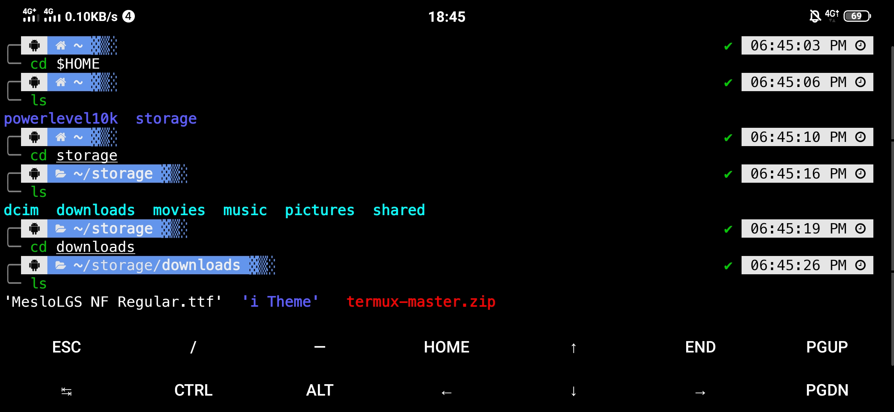

# Powerlevel10k
### These are my configurations of powerlevel10k with oh my zsh and GNOME terminal
- **This is how my terminal looks**

## Installation for Termux
1. Dont forget to update & upgrade packages
  - `pkg update -y && pkg upgrade -y`
2. Install requirements and zsh then setup as default shell
  - `pkg install git curl nano zsh`
  - `chsh -s zsh`
    - for detailed instructions <a href="https://github.com/ohmyzsh/ohmyzsh/wiki/Installing-ZSH">go here</a>
  - you also have to set your PATH from previous shell
  - copy export paths from previous shell config file and add it to **.zshrc** in your home directory
    - `echo $SHELL
      /usr/bin/zsh`
3. Install oh my zsh
  - `sh -c "$(curl -fsSL https://raw.githubusercontent.com/ohmyzsh/ohmyzsh/master/tools/install.sh)"`
  - Installation Tutorial for oh my zsh can be found <a href="https://github.com/ohmyzsh/ohmyzsh#basic-installation">here</a> 
4. Install powerlevel10k
  - `git clone --depth=1 https://github.com/romkatv/powerlevel10k.git ${ZSH_CUSTOM:-$HOME/.oh-my-zsh/custom}/themes/powerlevel10k`
  - follow oh my zsh installation instructions <a href="https://github.com/romkatv/powerlevel10k#installation">from here</a>
5. Auto Suggestion
  - `git clone https://github.com/zsh-users/zsh-autosuggestions.git $ZSH_CUSTOM/plugins/zsh-autosuggestions`
6. Auto Highlight
  - `git clone https://github.com/zsh-users/zsh-syntax-highlighting.git $ZSH_CUSTOM/plugins/zsh-syntax-highlighting`
7. Configure powerlevel10k
  - For your own costomizations
    - run `p10k configure` it will take care for the rest of steps
  - For my costomizations
    - clone this repo and replace **.zshrc** and **.p10k.zsh** in your home directory
    - `git clone https://github.com/rhxoxome/powerlevel10k`
    - `cd powerlevel10k && cp .zshrc ~/.zshrc && cp .p10k.zsh ~/.p10k.zsh && cd $HOME && rm -rf powerlevel10k`     
8. Changing customizations
      - Edit the **.zshrc** and **.p10k.zsh** (*RISKY*)
      - run `p10k configure` (*SAFE*)
## How to ask for help
- The best way to ask for help is to open an issue.
## Source
- <a href="https://medium.com/@satriajanaka09/setup-zsh-oh-my-zsh-powerlevel10k-on-ubuntu-20-04-c4a4052508fd">Medium.com/@SatriaJanaka09</a>

Have fun with your terminal ! 🎉
